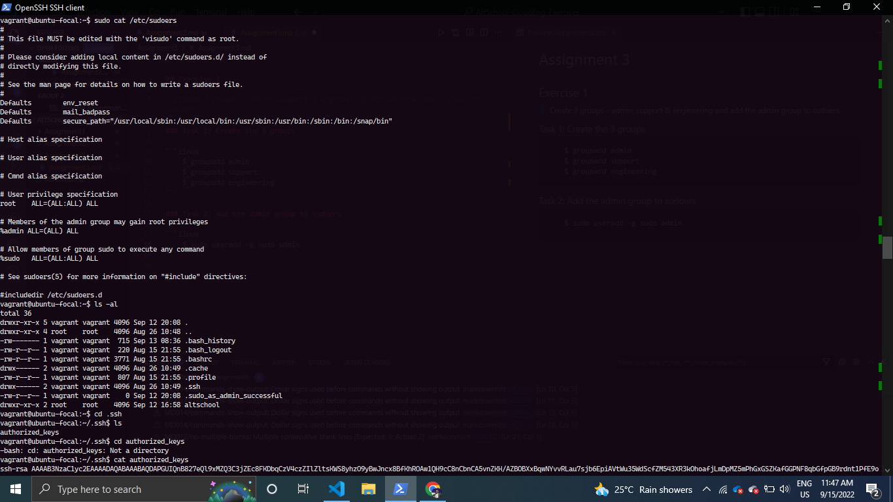
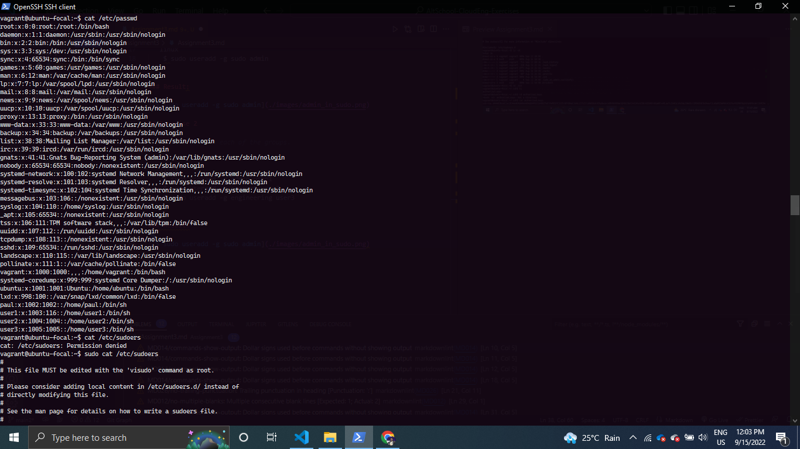
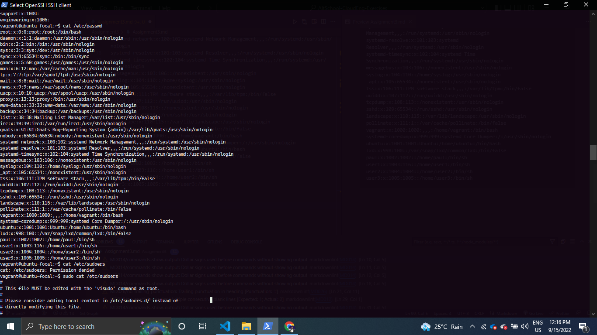
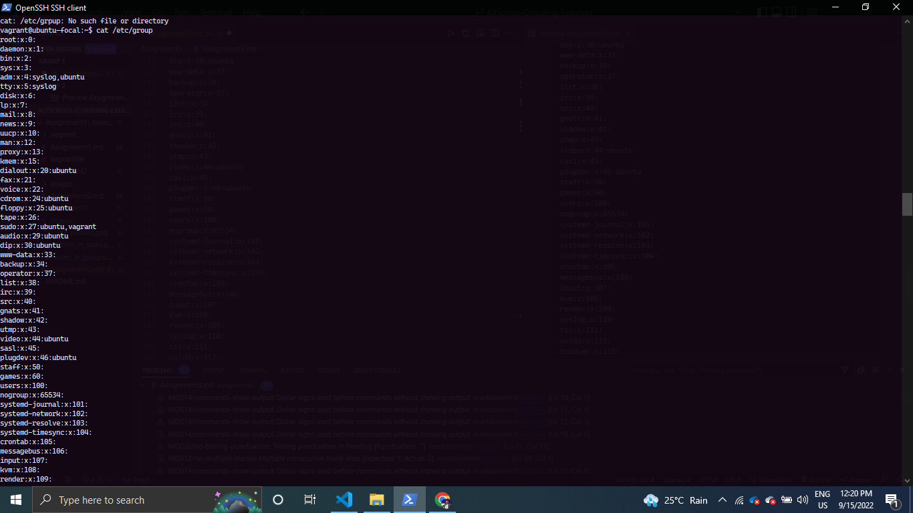
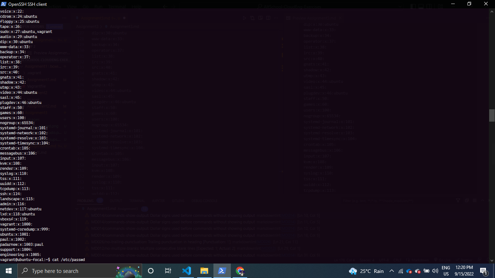
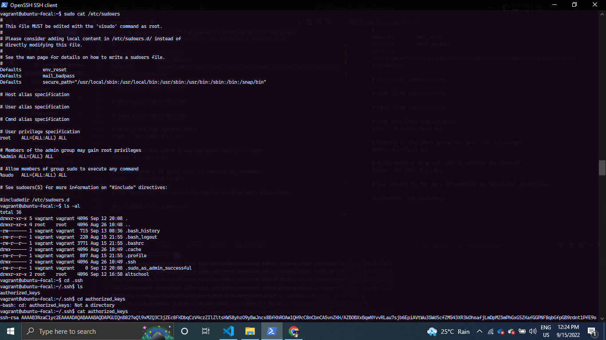

# Assignment 3

## Exercise 1

> Create 3 groups – admin, support & engineering and add the admin group to sudoers.

### Task 1: Create the 3 groups  

```linux
    $ groupadd admin
    $ groupadd support
    $ groupadd engineering
```

### Task 2: Add the admin group to sudoers

```linux
    $ sudo useradd -g sudo admin
```

### Result:



## Exercise 2

> Create a user in each of the groups.


```linux
    $ sudo useradd -g admin user1
    $ sudo useradd -g support user2
    $ sudo useradd -g engineering user3
```

### Result



## Exercise 3

> Generate SSH keys for the user in the admin group

### Task 1: Login to the user in the admin group. In my case, that is 'user1'.

```linux
    $ su user1
```

### Task 2: Generate the SSH keys for user1.

```linux
    ssh-keygen
```

## CONTENTS OF `/etc/passwd`

```linux
root:x:0:0:root:/root:/bin/bash
daemon:x:1:1:daemon:/usr/sbin:/usr/sbin/nologin
bin:x:2:2:bin:/bin:/usr/sbin/nologin
sys:x:3:3:sys:/dev:/usr/sbin/nologin
sync:x:4:65534:sync:/bin:/bin/sync
games:x:5:60:games:/usr/games:/usr/sbin/nologin
man:x:6:12:man:/var/cache/man:/usr/sbin/nologin
lp:x:7:7:lp:/var/spool/lpd:/usr/sbin/nologin
mail:x:8:8:mail:/var/mail:/usr/sbin/nologin
news:x:9:9:news:/var/spool/news:/usr/sbin/nologin
uucp:x:10:10:uucp:/var/spool/uucp:/usr/sbin/nologin
proxy:x:13:13:proxy:/bin:/usr/sbin/nologin
www-data:x:33:33:www-data:/var/www:/usr/sbin/nologin
backup:x:34:34:backup:/var/backups:/usr/sbin/nologin
list:x:38:38:Mailing List Manager:/var/list:/usr/sbin/nologin
irc:x:39:39:ircd:/var/run/ircd:/usr/sbin/nologin
gnats:x:41:41:Gnats Bug-Reporting System (admin):/var/lib/gnats:/usr/sbin/nologin
nobody:x:65534:65534:nobody:/nonexistent:/usr/sbin/nologin
systemd-network:x:100:102:systemd Network Management,,,:/run/systemd:/usr/sbin/nologin
systemd-resolve:x:101:103:systemd Resolver,,,:/run/systemd:/usr/sbin/nologin
systemd-timesync:x:102:104:systemd Time Synchronization,,,:/run/systemd:/usr/sbin/nologin
messagebus:x:103:106::/nonexistent:/usr/sbin/nologin
syslog:x:104:110::/home/syslog:/usr/sbin/nologin
_apt:x:105:65534::/nonexistent:/usr/sbin/nologin
tss:x:106:111:TPM software stack,,,:/var/lib/tpm:/bin/false
uuidd:x:107:112::/run/uuidd:/usr/sbin/nologin
tcpdump:x:108:113::/nonexistent:/usr/sbin/nologin
sshd:x:109:65534::/run/sshd:/usr/sbin/nologin
landscape:x:110:115::/var/lib/landscape:/usr/sbin/nologin
pollinate:x:111:1::/var/cache/pollinate:/bin/false
vagrant:x:1000:1000:,,,:/home/vagrant:/bin/bash
systemd-coredump:x:999:999:systemd Core Dumper:/:/usr/sbin/nologin
ubuntu:x:1001:1001:Ubuntu:/home/ubuntu:/bin/bash
lxd:x:998:100::/var/snap/lxd/common/lxd:/bin/false
paul:x:1002:1002::/home/paul:/bin/sh
user1:x:1003:116::/home/user1:/bin/sh
user2:x:1004:1004::/home/user2:/bin/sh
user3:x:1005:1005::/home/user3:/bin/sh
```



## CONTENTS OF `/etc/group`

```linux
    vagrant@ubuntu-focal:~$ cat /etc/group
root:x:0:
daemon:x:1:
bin:x:2:
sys:x:3:
adm:x:4:syslog,ubuntu
tty:x:5:syslog
disk:x:6:
lp:x:7:
mail:x:8:
news:x:9:
uucp:x:10:
man:x:12:
proxy:x:13:
kmem:x:15:
dialout:x:20:ubuntu
fax:x:21:
voice:x:22:
cdrom:x:24:ubuntu
floppy:x:25:ubuntu
tape:x:26:
sudo:x:27:ubuntu,vagrant
audio:x:29:ubuntu
dip:x:30:ubuntu
www-data:x:33:
backup:x:34:
operator:x:37:
list:x:38:
irc:x:39:
src:x:40:
gnats:x:41:
shadow:x:42:
utmp:x:43:
video:x:44:ubuntu
sasl:x:45:
plugdev:x:46:ubuntu
staff:x:50:
games:x:60:
users:x:100:
nogroup:x:65534:
systemd-journal:x:101:
systemd-network:x:102:
systemd-resolve:x:103:
systemd-timesync:x:104:
crontab:x:105:
messagebus:x:106:
input:x:107:
kvm:x:108:
render:x:109:
syslog:x:110:
tss:x:111:
uuidd:x:112:
tcpdump:x:113:
ssh:x:114:
landscape:x:115:
admin:x:116:
netdev:x:117:ubuntu
lxd:x:118:ubuntu
vboxsf:x:119:
vagrant:x:1000:
systemd-coredump:x:999:
ubuntu:x:1001:
paul:x:1002:
padarnew:x:1003:paul
support:x:1004:
engineering:x:1005:
```






## CONTENTS OF `/etc/sudoers`

```linux
    vagrant@ubuntu-focal:~$ sudo cat /etc/sudoers
#
# This file MUST be edited with the 'visudo' command as root.
#
# Please consider adding local content in /etc/sudoers.d/ instead of
# directly modifying this file.
#
# See the man page for details on how to write a sudoers file.
#
Defaults        env_reset
Defaults        mail_badpass
Defaults        secure_path="/usr/local/sbin:/usr/local/bin:/usr/sbin:/usr/bin:/sbin:/bin:/snap/bin"

# Host alias specification

# User alias specification

# Cmnd alias specification

# User privilege specification
root    ALL=(ALL:ALL) ALL

# Members of the admin group may gain root privileges
%admin ALL=(ALL) ALL

# Allow members of group sudo to execute any command
%sudo   ALL=(ALL:ALL) ALL

# See sudoers(5) for more information on "#include" directives:

#includedir /etc/sudoers.d
```


