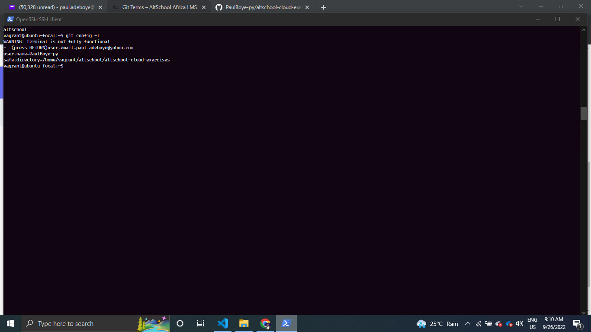
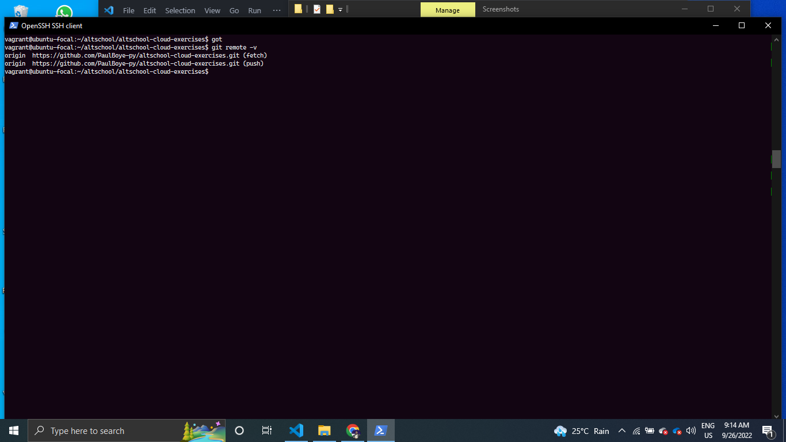
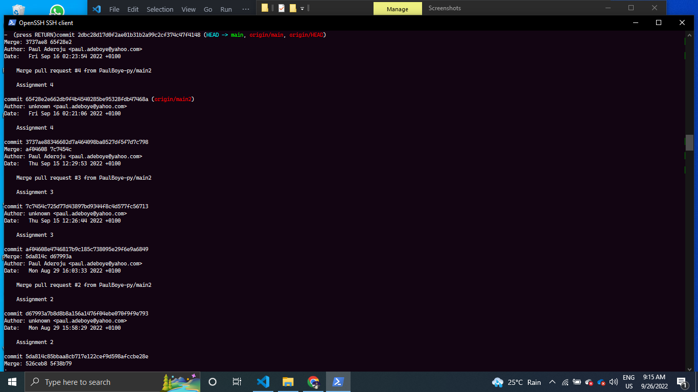

# Assignment 5

## Exercise 1

Clone altschool-cloud-exercises project to your local system.

 ```linux
    $git clone https://github.com/PaulBoye-py/altschool-cloud-exercises.git
```

## Exercise 2

Setup your name and email in Git’s global config

```linux
    $git config --global user.email "your_email@example.com"
    $git config --global user.name "your_name"
```

## Exercise 3

### Output of `git config -l`



___

### Output of `git remote -v`



___

### Output of `git log`


